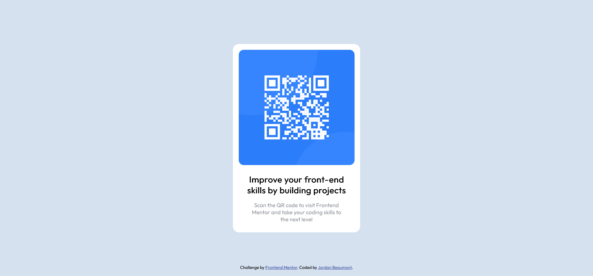

# Frontend Mentor - QR code component solution

This is a solution to the [QR code component challenge on Frontend Mentor](https://www.frontendmentor.io/challenges/qr-code-component-iux_sIO_H). Frontend Mentor challenges help you improve your coding skills by building realistic projects.

## Table of contents

- [Overview](#overview)
  - [Screenshot](#screenshot)
  - [Links](#links)
- [My process](#my-process)
  - [Built with](#built-with)
  - [What I learned](#what-i-learned)
  - [Continued development](#continued-development)
- [Author](#author)

**Note: Delete this note and update the table of contents based on what sections you keep.**

## Overview

### Screenshot

### Links

- Solution URL: [Add solution URL here](https://github.com/jordanbmnt/qr-code-component-main)
- Live Site URL: [Add live site URL here](https://jordanbmnt.github.io/qr-code-component-main/)

## My process

### Built with

- Semantic HTML5 markup
- CSS custom properties
- Flexbox
- Mobile-first workflow

### What I learned

I learned how to design to scale 🔥. This was a great ice-breaker.

### Continued development

I want to focus on Grid displays in future projects. I'm using this project as a sort of ice-breaker for Frontend Mentor.

## Author

- Frontend Mentor - [@jordanbmnt](https://www.frontendmentor.io/profile/jordanbmnt)
- Twitter - [@jordanbmnt](https://www.twitter.com/jordanbmnt)
- Instagram - [@soy_jimb](https://instagram.com/soy_jimb?igshid=OGQ5ZDc2ODk2ZA==)
